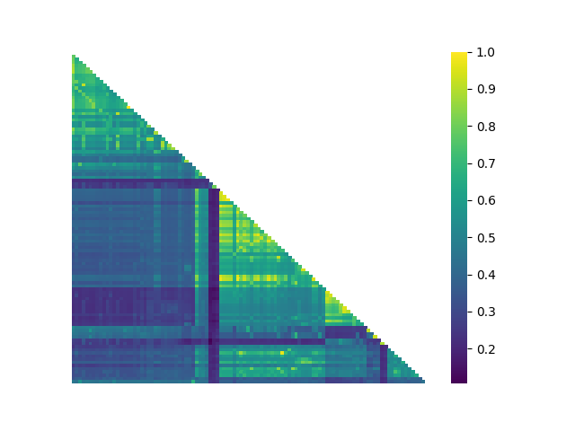

# molSim README
molSim is a tool for visualizing diversity in your molecular data-set using graph theory. 

## Purpose

__Why Do We Need To Visualize Molecular Similarity / Diversity?__

There are two broad contexts where it is helpful to visualize the diversity of a molecular dataset:

_Experimental Synthesis_

For a chemist, synthesizing new molecules with targeted properties is often a laborious and time consuming task.
In such a case, it becomes useful to check the similarity of a newly proposed (un-synthesized) molecule to the ones already synthesized.
If the proposed molecule is too similar to the existing repertoire of molecules, it will probably not yield not enough new information /
property and thus need not be synthesized. On the other hand, if the aim is to replicate the properties of a high performing molecule,
it is useful to ensure that each new proposed molecule is similar to the high performing one. In both cases, a chemist can avoid spending
time and effort synthesizing molecules not useful for the project.

_Machine Learning Molecular Properties_

In the context of machine learning, visualizing the diversity of the training set gives a good idea about its information quality.
A more diverse training data-set yields a more robust model, which generalizes well to unseen data. Additionally, such a visualization can 
identify "clusters of similarity" indicating the need for separately trained models for each cluster.

_Substrate Scope Robustness Verification_

When proposing a novel reaction it is essential for the practicing chemist to evaluate the transformation's tolerance of diverse functional groups and substrates (Glorius, 2013). Using `molSim`, one can evaluate the structural and chemical similarity across an entire susbtrate scope to ensure that it avoids redundant species. Below is an example similarity heatmap generated to visualize the diversity of a three-component sulfonamide coupling reaction with a substantial number of substrates (Chen, 2018).

Many of the substrates appear similar to one another and thereby redundant, but in reality the core sulfone moiety and the use of the same coupling partner when evaluating functional group tolerance accounts for this apparent shortcoming. Also of note is the region of high similarity along the diagonal where the substrates often differ by a single halide heteratom or substitution pattern.

## Installing molSim
### Conda
Use the following command with conda to create an environment:
`conda create --name your-env-name --file spec-file.txt`

1. Python 3+
2. Matplotlib
3. Numpy
4. RDKIT
5. SEABORN
6. PyYAML
7. Pandas 1.0.1+
8. openpyxl

### Pip
_coming soon_
~~To install molSim using pip, run the following command: `pip install molSim`~~

## Running molSim
Example Run:
`python -m molSim config.yaml`
Tests:
`python -m unittest discover`
User interface:
`pythong -m molSim-ui-main`

## Notes

### General Workflow

Molecular Structure Information (SMILES strings, *.pdb files etc.) --> Generate a Molecular Graph / Environment Fingerprint
--> Calculate a "similarity score" between moelcules based on some distance between their fingerprints.

### Currently Implemented Fingerprints

1. Morgan Fingerprint (Equivalent to the ECFP-6)
2. RDKIT Topological Fingerprint

### Currently Implemented Similarity Scores

1. Tanomito Similarity (0 for completely dissimilar and 1 for identical molecules)
2. Negative L0, L1 and L2 norms
3. Cosine Similarity

### Currently Implemented Functionalities

1. compare_target_molecule: Compare a proposed molecules to existing molecular database. The outputs are a similarity density plot
and/ or the least similar and most similar molecules in the database (to the proposed molecule)

2. visualize_dataset: Visualize the diversity of molecules in existing database. The outputs are a heatmap of similarity scores and/or
a density plot of similarity scores and /or a parity plot showing some molecular property (e.g. boiling point) between 
pairs of most similar molecules. The last output requires the input of the molecular property for each molecule.
This can be inputted as a .txt file containing rows of name property pairs. An example of such a file with fictitious properties is
provided in the file smiles_responses.txt. This option is typically used to check the suitability of the fingerprint / similarity measure
for a property of interest. If they do a good job for the particular property then the parity plot should be scattered around the diagonal.

## Credits and Licensing

Lead Developer: Himaghna Bhattacharjee, Vlachos Research Lab. (www.linkedin.com/in/himaghna-bhattacharjee)

Developer: Jackson Burns, Don Watson Lab. ([Personal Site](https://www.jacksonwarnerburns.com/))

## License
MIT Open

## Works Cited
Collins, K., Glorius, F. A robustness screen for the rapid assessment of chemical reactions. Nature Chem 5, 597–601 (2013). https://doi.org/10.1038/nchem.1669

Yiding Chen, Philip R. D. Murray, Alyn T. Davies, and Michael C. Willis
Journal of the American Chemical Society 2018 140 (28), 8781-8787
DOI: 10.1021/jacs.8b04532
